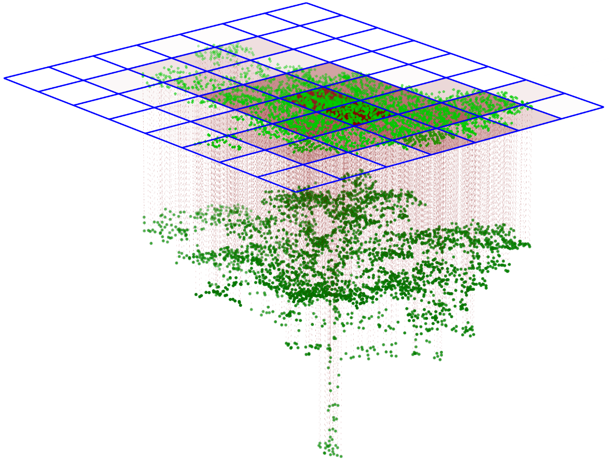
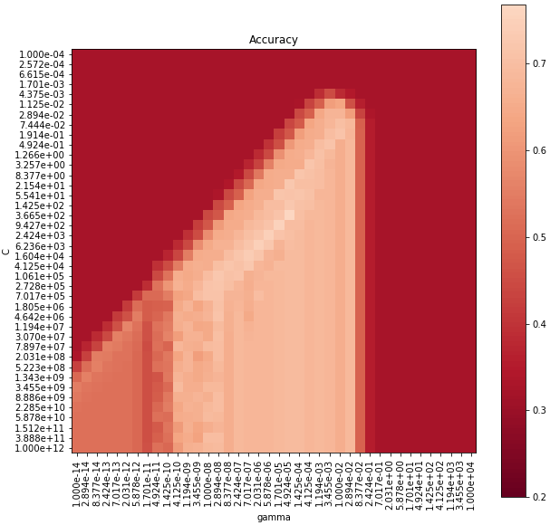
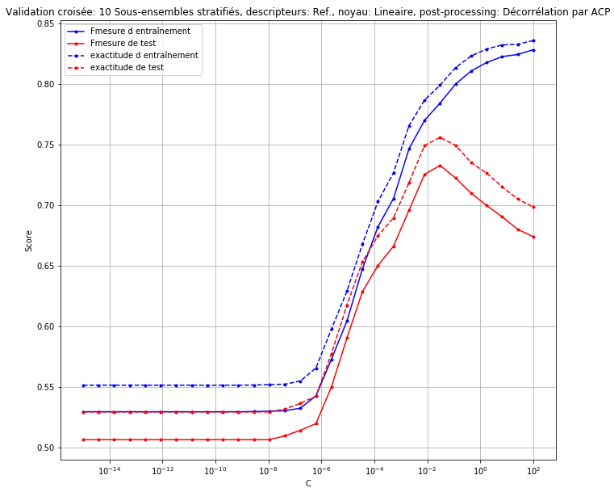

# Mapping Tree Species from the Sky: Combining LiDAR and Hyperspectral Data

**This project combined LiDAR and hyperspectral imagery — two technologies that, when fused, reveal both the structure and the spectral features of vegetation. Ten years ago, during my studies, this topic was one of my very first encounters with machine learning. An exciting project that I would, of course, approach differently today. Here is a summary of it.**

---

## The Idea

Can we automatically identify tree species in complex forest or peri-urban environments using remote sensing?
The project focused on the **forests near Lausanne and Neuchâtel**, where both **LiDAR point clouds** and **APEX hyperspectral imagery** were available.

* **LiDAR** provided a 3D model of the canopy, with millions of points per hectare describing the height and shape of each tree.
* **Hyperspectral data** offered fine-grained optical information across **285 spectral bands** (380–2500 nm), revealing subtle differences in leaf chemistry and structure.

By combining them, the goal was to link *what a tree looks like in 3D* with *how it reflects light*.

---

## The Data

| Sensor | Acquisition | Key Specs |
|--------|-------------|-----------|
| APEX Hyperspectral | July 2014 | 285 bands, 2.62m resolution, 380-2500nm |
| LIDAR | 2012-2016 | 30-80 points/m², pre-segmented to individual trees |
| Ground truth | Field surveys | Species labels for training/validation |
*Table 1: Data Summary*

*Figure 1: Study area, in RGB bands (left) and three Hyperspectral bands (right). Green dots show "known tree" locations over rgb imagery*

---

## Methodology: Linking Structure and Spectra

The key methodological step was the **projection of LiDAR points onto the hyperspectral image**.
Each LiDAR echo, georeferenced in 3D, was mapped to the corresponding pixel in the hyperspectral raster. This allowed us to:

1. Identify which pixels truly belong to each tree crown.
2. Weight the reflectance values by the number of LiDAR echoes per pixel — giving **greater influence to pixels containing more tree surface area** (see figure below).
3. Produce an aggregated, **weighted spectral signature per tree**.

*Figure 2: Projection of LiDAR echoes onto hyperspectral pixels. Each pixel’s reflectance is weighted by the number of echoes it contains, yielding an average spectral signature per tree.*

---

## Two Scales of Analysis

To compare two analysis scales and to handle class imbalance, two complementary strategies were developed:

### 1. Tree-Based Classification (Dataset 1)

Each tree was represented by its aggregated, weighted reflectance spectrum.
This produced **224 observations** across **five main species**, including *Picea abies* (Norway spruce), *Quercus robur* (pedunculate oak), and *Larix decidua* (European larch).
Morphological descriptors derived from LiDAR (e.g., height quantiles, total height) were added to the spectral features.

**Goal:** Classify entire trees as single units.

---

### 2. Pixel-Based Classification (Dataset 2)

To increase sample size, crowns segmented from LiDAR were projected onto the hyperspectral image.
Only **pixels fully contained** within a crown projection were kept, avoiding mixed reflectances at crown boundaries.

This generated a much larger dataset:
**5 926 observations across 11 tree species**, with at least 100 pixels per class.

**Goal:** Learn from many more, but noisier, samples.

---

## Machine Learning: Support Vector Machines (SVMs)

Classification relied on **Support Vector Machines**, chosen for their robustness with small, high-dimensional datasets.
Several configurations were tested:

* **Kernels:** Linear vs Radial Basis Function (RBF)
* **Preprocessing:** Standardization, PCA decorrelation, 99% variance reduction
* **Feature combinations:** Spectral bands, vegetation indices, and LiDAR morphology

Models were evaluated using **stratified cross-validation** and the **F1-score** as the main metric.

  <figure style="margin:0; padding:0 4px; text-align:center; width:45%;">
    
    <figcaption style="font-size:0.9em; margin-top:0px;"> (a) Model adjustment across hyperparameters</figcaption>
  </figure>
  <figure style="margin:0; padding:0 4px; text-align:center; width:53.5%;">
    
    <figcaption style="font-size:0.9em; margin-top:0px;">(b) Model validation with Weighted average F1-score across validation folds.</figcaption>
  </figure>

*Figure 4: (a) Model adjustment as a function of gamma (kernel parameter) and C (regularization). Best performance: C = 366.52, gamma = 4.9238e-5, F1-score = 0.760, Accuracy = 0.768. (b) Weighted average F1-score across validation folds.*

---

## Results at a Glance

| Dataset | Scale       | Features               | Best Kernel | F1-score | Notes                         |
| ------- | ----------- | ---------------------- | ----------- | -------- | ----------------------------- |
| **1**   | Tree-based  | Spectral bands + LiDAR + PCA | **RBF**     | **0.76** | Best overall performance      |
| **2**   | Pixel-based | Spectral bands + PCA     | Linear      | 0.72     | Larger dataset, simpler model |

Each settup from tree-based optimization has been with ant without LIDAR features. Adding **LiDAR-derived morphology** systematicaly improved performance — confirming the value of combining 3D structure with spectral data.

Species-level accuracy varied:

* *Quercus robur* and *Picea abies* reached **F1 > 0.9**,
* while the “other species” residual class remained challenging due to its high variability.

---

## Conclusion

1. **Data fusion works:** Combining LiDAR and hyperspectral data systematically improves accuracy.
2. **Aggregation helps:** Averaging reflectances at the tree level reduces pixel-level noise. Tree-based analysis is more stable; pixel-based captures more detail but is noisier.
3. **Even small datasets can perform well** when features are well-engineered and balanced.

This project successfully demonstrated the feasibility of automated tree species classification in complex urban and peri-urban environments using airborne remote sensing. By combining the spatial precision of LIDAR with the spectral richness of hyperspectral imagery, we achieved robust classification performance on most classes. Higher performance could definitely be expected with a slightly larger dataset, especially with more trees from some imbalanced classes.

The approach shows promise for:
- **Forestry management**: Rapid species inventories over large areas
- **Urban planning**: Monitoring urban forest composition
- **Biodiversity assessment**: Tracking species distribution changes
- **Carbon accounting**: Species-specific biomass estimates

Several challenges remain:
- **Residual class variability**: The "other species" category inherently contains high spectral and morphological diversity
- **Underrepresented species**: Some classes had insufficient samples for robust model training
- **Temporal mismatch**: LIDAR and hyperspectral data were acquired in different seasons/years

Potential improvements could include:
- **Multi-temporal data** to capture seasonal phenological differences
- **Additional morphological features** beyond height distributions

---

*Project completed in 2017 at EPFL, supervised by Matthew Parkan*

---
