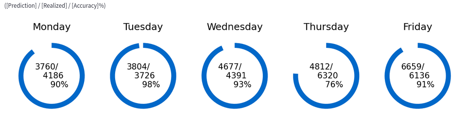
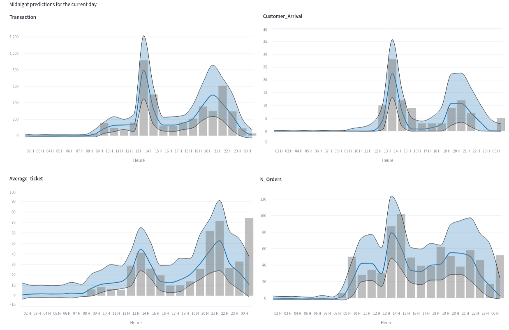

---

title: Predicting Restaurant Client Flow with Transformer-Based Deep Learning
summary: ""
tags:
- Deep Learning
- Time Series Forecasting 
- interactive dashboard 
date: "2023-01-15T00:00:00Z"

# Optional external URL for project (replaces project detail page).
external_link: ""

image:
  caption: Daily and hourly predictions.
  focal_point: Smart

links:
- icon: laptop
  icon_pack: fab
  name: Demo Platform
  url: https://selam88-tempo-dash.streamlit.app/
url_code: "https://selam88-tempo-dash.streamlit.app/"

url_pdf: ""
url_slides: ""
url_video: ""

# Slides (optional).
#   Associate this project with Markdown slides.
#   Simply enter your slide deck's filename without extension.
#   E.g. `slides = "example-slides"` references `content/slides/example-slides.md`.
#   Otherwise, set `slides = ""`.
slides: ""

---

## Predicting Restaurant Customer Flow with Transformer-Based Deep Learning

In the ever-evolving world of restaurant management, understanding and anticipating customer flow is key to optimizing operations. Whether it’s staffing, inventory management, or food preparation, having accurate predictions on when and how many customers will show up is a game changer. With advancements in AI, particularly deep learning, we are now able to tackle this challenge more efficiently than ever before.

## The Challenge: Predicting Customer Flow

Restaurants often face fluctuating demand based on factors like time of day, day of the week, holidays, weather conditions, and even special events. Traditional forecasting methods, while somewhat effective, often fall short when it comes to capturing the complex, dynamic patterns in customer behavior. This leads to either over-preparation, which wastes resources, or under-preparation, which results in poor customer service.

To address this, I embarked on a project to develop a deep learning model capable of predicting customer flow with a higher degree of accuracy. The model is based on Transformer technology—a model architecture originally designed for natural language processing tasks—and functions as a multivariate time series model. This architecture can handle multiple types of input data, including real or categorical variables from both static and time-dependent features, offering unparalleled flexibility and accuracy in its predictions.

## Why Transformers?

Transformers have proven to be groundbreaking in handling sequential data due to their self-attention mechanism, which allows the model to focus on relevant parts of the input regardless of its position in the sequence. This is particularly useful for time series prediction, where past events (such as customer visits) have a direct influence on future outcomes. By leveraging this architecture, the model can “attend” to specific moments in time—whether it's a recent surge in customers or a trend observed over previous weeks—when making its predictions.

Beside, one of the key advantages of this Transformer-based model is its ability to work as a multivariate time series model. It integrates multiple features from different types that impact customer flow, such as:

- **Real time-dependent variables** (e.g., weather variables, previous customer counts)
- **Categorical time-dependent variables** (e.g., day of the week, holidays, local events)
- **Static features** (e.g., restaurant location)

Lastly, the architecture involves both an encoder and a decoder based on Transformers. The encoder processes information related to the past of the predicted time, while the decoder handles all "known" information relevant to the predicted hour or day. If a "known" variable is also recorded in the past and used by the encoder — which is typically the case — it's possible to apply the same preprocessing to that variable for both the encoder and decoder.

Let's take a common example from bars and restaurants: "Happy Hour." This can be represented as a "known" hourly, time-dependent categorical variable. When predicting future customer flow, the model can consider the past Happy Hour schedule as well as the current plan at the predicted time. This enables the model to factor in both historical and future scheduling information when making its predictions.

This flexibility allows the model to account for a wide range of factors that influence customer visits, making it a powerful tool for restaurant managers to anticipate demand with precision.

## Building the Model

The model is trained to predict several hourly and daily indicators. The hourly indicators include: the **number of arrivals**, the **total number of orders**, the **number of full meal orders**, the **number of drink or standing orders**, the **average ticket price**, and the **total transaction value**. Additionally, the model can forecast the **total daily transaction** for the next five days, allowing managers to assess and compare upcoming days.

On the other hand, the hourly indicators help predict peak periods throughout the day. High arrival times require staff to be available for seating customers, setting tables, and providing menus. Periods with increased pressure on full meal orders—often reflected by a **high average ticket** price—can be distinguished from times when quick-service orders like coffee, breakfast, or beverages dominate. This helps managers plan resources accordingly for different types of demand throughout the day.

The model is trained using historical data and its performance is evaluated by simulating each week separately. For every simulated week, the model is re-trained from scratch using only the data available prior to that test week. This ensures that the model is evaluated in realistic conditions, where future data is unknown and predictions are made based solely on past observations. By re-training for each week, the model’s ability to generalize is rigorously tested, providing a robust evaluation of its predictive accuracy over time.
The result was a model capable of making highly accurate, time-specific predictions, which could be used to make informed decisions in real time.

## Results and Demo Platform

Comparing hourly indicators helps anticipate peak times for customer arrivals, periods with high-value orders, and extended service durations when clients stay longer and require more attention. Typically, the prediction will indicate whether the first or second lunch service will experience higher arrivals, allowing for better staff planning. High-value order periods will be marked by a higher average ticket with the same amount of arrivals or fewer orders. The analysis will also reveal times when clients prefer a quick meal versus when they choose to stay longer and enjoy their time.

To showcase the capabilities of this model, I created an interactive demo platform where users can input their restaurant’s data and receive detailed customer flow predictions. The platform allows restaurant managers to visualize predicted customer volumes over time and adjust their staffing, inventory, and preparation strategies accordingly.

**[Please, have a look on the full demo plateform](https://selam88-tempo-dash.streamlit.app/)**

