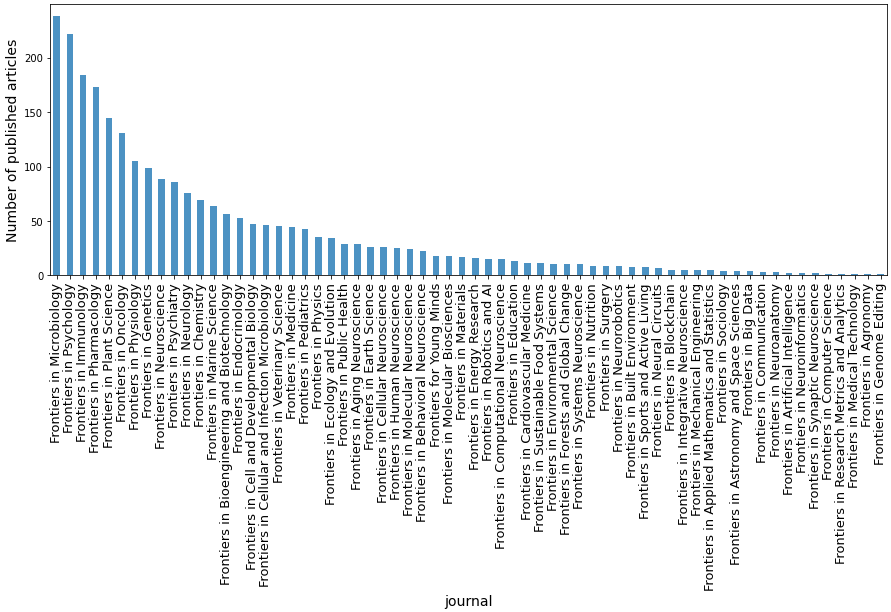
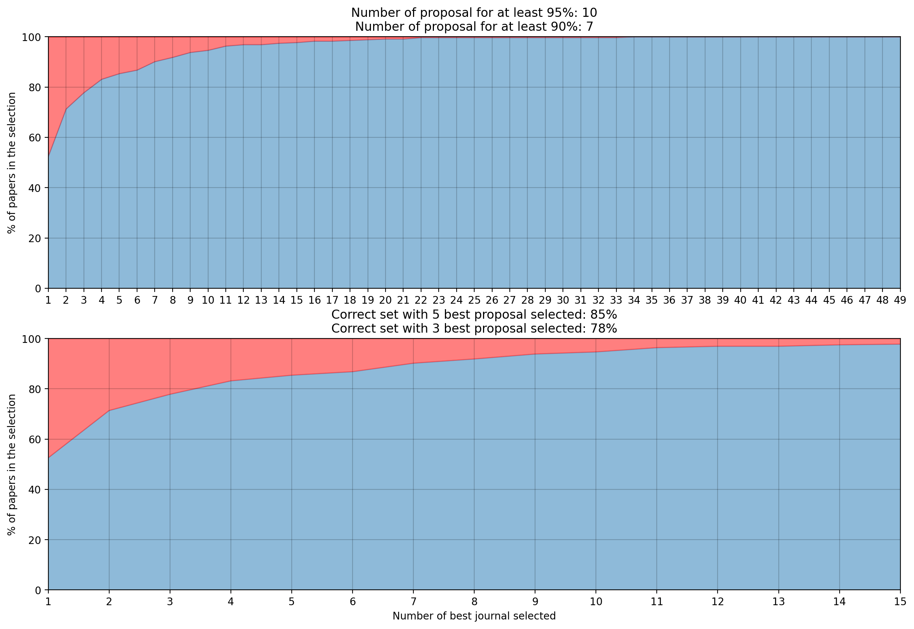
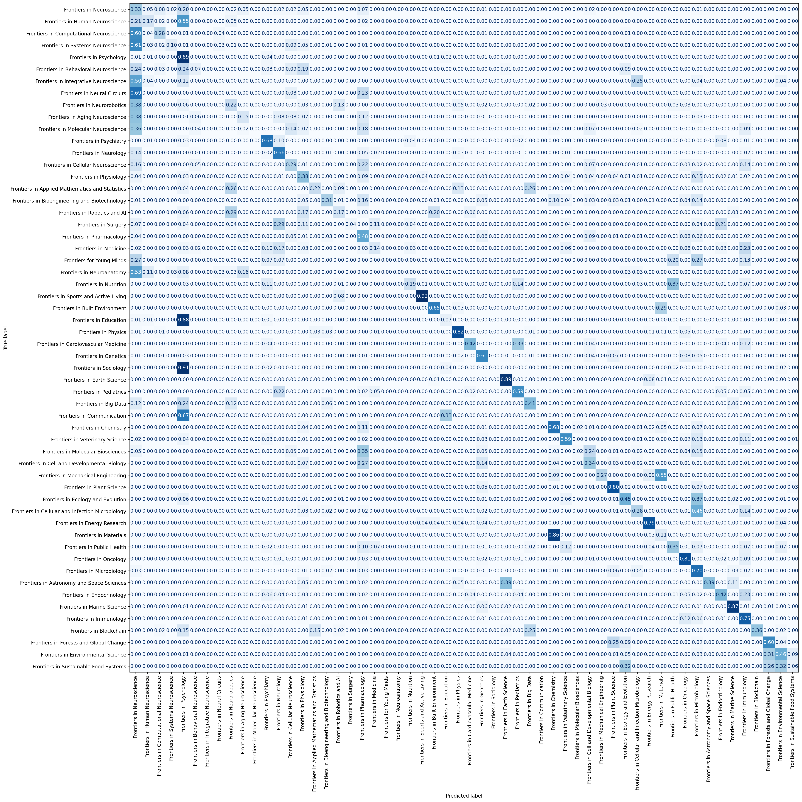

**How NLP Can Help Publishers Find the Perfect Journal for Your Paper**

In the fast-paced world of academic publishing, time is everything. Reviewers spend hours evaluating submissions, often having to turn away those that don’t fit a journal’s scope. For an open-access publisher like **Frontiers**, with journals covering a broad range of scientific disciplines, this process can be streamlined through automation. Here, I walk through our approach to designing an NLP-driven classifier that recommends journals based on an article’s content.

### 🚀 The Mission: Streamline Journal Recommendations

Every year, Frontiers receives thousands of articles covering everything from neuroscience to environmental science. While this is great for scientific progress, it puts a burden on the peer-review process—especially when articles are submitted to journals outside their scope. The goal of this project was to build a system that could recommend a shortlist of the most suitable journals for each article, based on text alone, to streamline the review process. We aimed to create a system that would:
- Automatically suggest most relevant journals based on article content,
- Operate with high accuracy, given the diversity of journal topics
- be easy to integrate into Frontiers’ workflows
- Offer a reliable performance measure.

### 🔍 The Dataset: January 2020 Submissions

The dataset used included all articles published by Frontiers in January 2020, covering **64 different journals**. Here’s the catch: journal popularity varied widely, with some journals having over 200 publications and others with fewer than 10. This imbalance posed a challenge for the model, addressed by carefully managing data handling and preprocessing.

### 🛠️ The Approach: Leveraging BERT and XLNet for NLP

The project was designed as a multi-label classification problem, where each article might be suited to more than one journal. Two NLP models—**BERT** and **XLNet**— were chosen for testing their strong performance in language understanding. Using libraries such as **FastBERT** and **Hugging Face**, a pipeline has been set up to quickly test different configurations, and fine-tune each model on the dataset.

#### Data Preprocessing

Data preprocessing is crucial for performance:
- Each article was split into sequences to increase training samples, capturing sections like the title, abstract, and author details, while excluding less informative parts like bibliographies.
- We divided the dataset into training (75%), validation (12.5%), and test sets (12.5%). Journals with fewer than three publications were excluded due to insufficient data. As a result, each dataset contains at least one example of every journals.

### 🔬 How We Evaluated Model Success

To test the models, several performance metrics were established:
- **F1-Score** for precision and recall insights.
- **Confusion Matrix** to visualize classification errors and highlight relationships between journals with overlapping fields.
- **Top-N Recommendation Accuracy**, a key usability metric that measures how often the correct journal appears in the top suggestions. 

This last metric was especially important for practical use—after all, the goal was to create a tool that helps editors quickly narrow down journal choices.

### 📈 Results: BERT Takes the Lead

The table below summarizes the results after training each model on sequences of 300 and 400 words:

| Model       | F1-Score (All Sequences) | F1-Score (Initial Sequences) |
|-------------|---------------------------|------------------------------|
| **BERT-300** | 0.51                     | 0.49                         |
| **BERT-400** | 0.39                     | 0.40                         |
| **XLNet-300** | 0.49                     | 0.50                         |

With a 300-word sequence length, both **BERT** and **XLNet** delivered competitive performance, though **BERT** emerged slightly ahead in usability tests. With **BERT, 78% of true journals were within the top 3 recommendations**, and this increased to **85% within the top 5**. This success rate could be further optimized by averaging predictions across an article’s sequences.

### 💡 Key Insights and Next Steps

Analyzing the **confusion matrix** of the BERT model highlighted that journals with related fields (e.g., neuroscience subfields) were often confused. This indicates the need to account for overlapping disciplines in future training.

Several potential improvements include:
1. **Class Weights**: Applying weights to balance class loss, especially for underrepresented journals, would help address data imbalance.
2. **Average Predictions**: Averaging predictions across an article’s sequences will statistically improve consistency and reduce misclassifications.

### 🌟 Conclusion: AI-Powered Journal Recommendations for a Smarter Publishing Process

Imagine an editor opening a new submission and immediately seeing a list of journals likely to be a perfect fit—saving time, effort, and accelerating the path to publication. This project is a significant step in that direction, showing that **AI can bring real-world impact to scientific publishing**. By continuing to refine this system, we’re optimistic about achieving even more accurate, user-friendly journal recommendations.

### 🧑‍💻 Explore the Code

**GitHub Repository**: For those interested, you can explore the code in the [GitLab repository](https://gitlab.com/Selam08/papers-multiclass-classification).

---

This streamlined approach to journal recommendation combines cutting-edge NLP with practical considerations, promising efficiency gains for publishers and authors alike.
