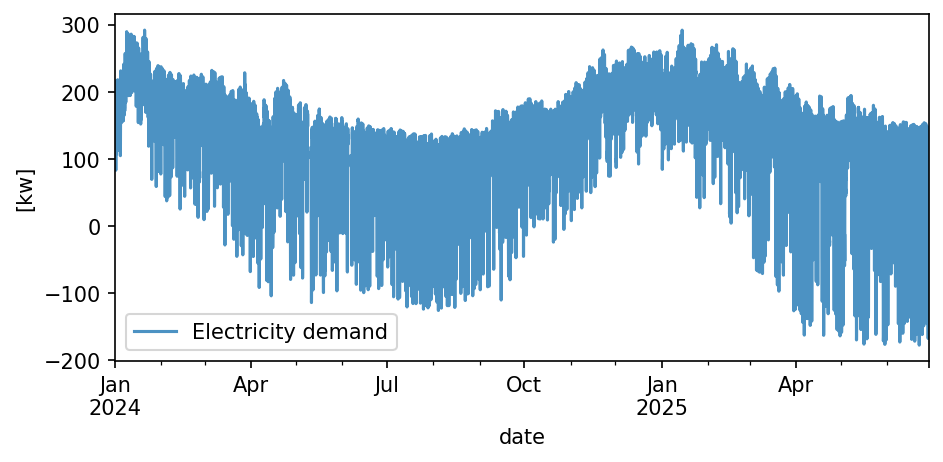
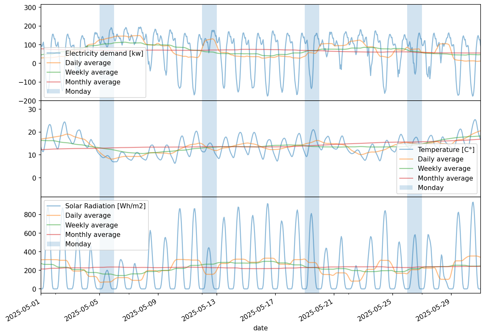
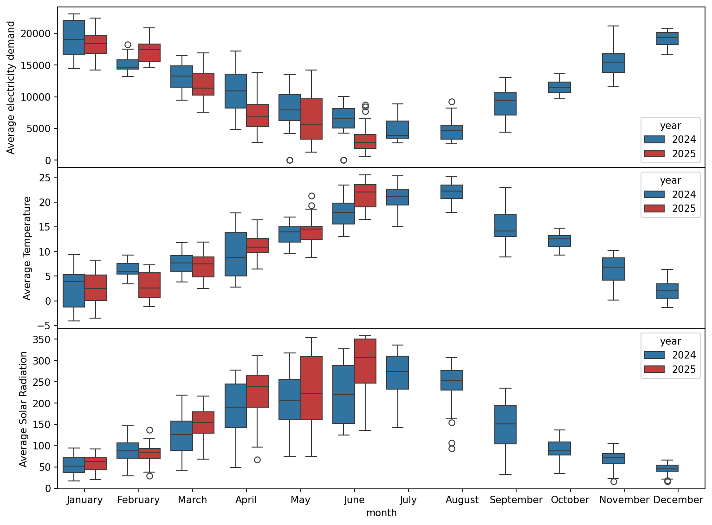
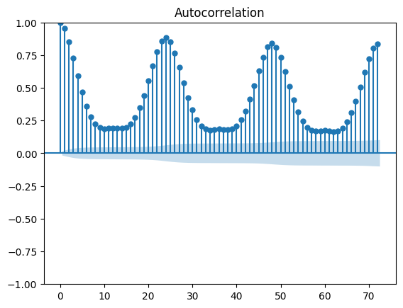
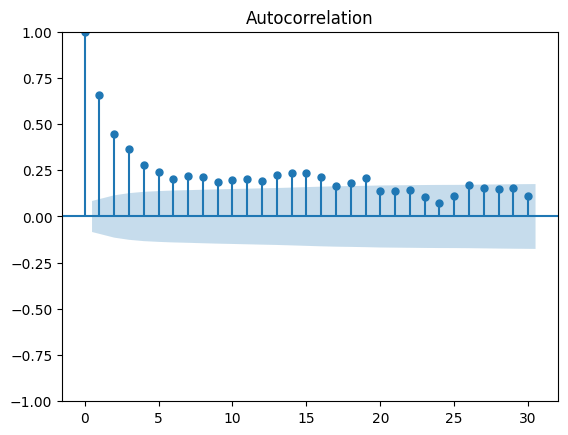
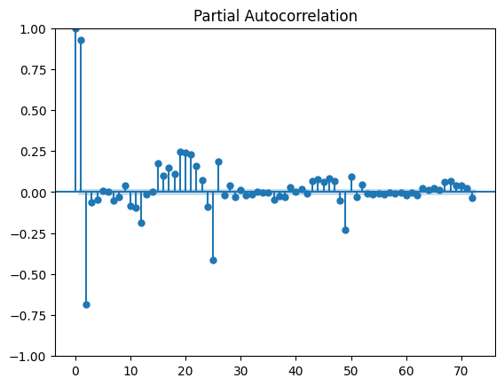
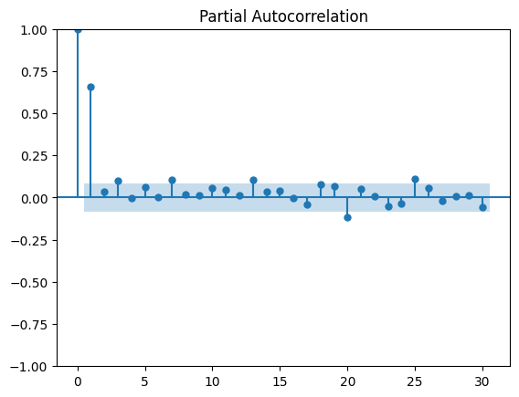
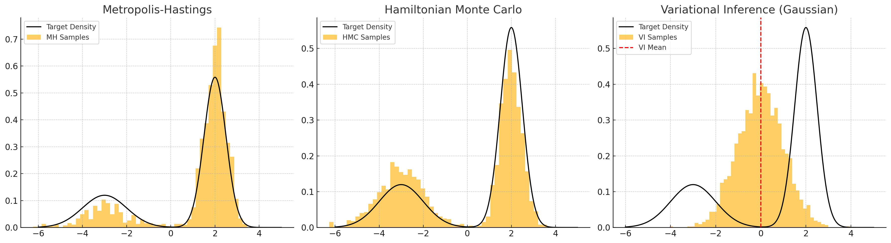
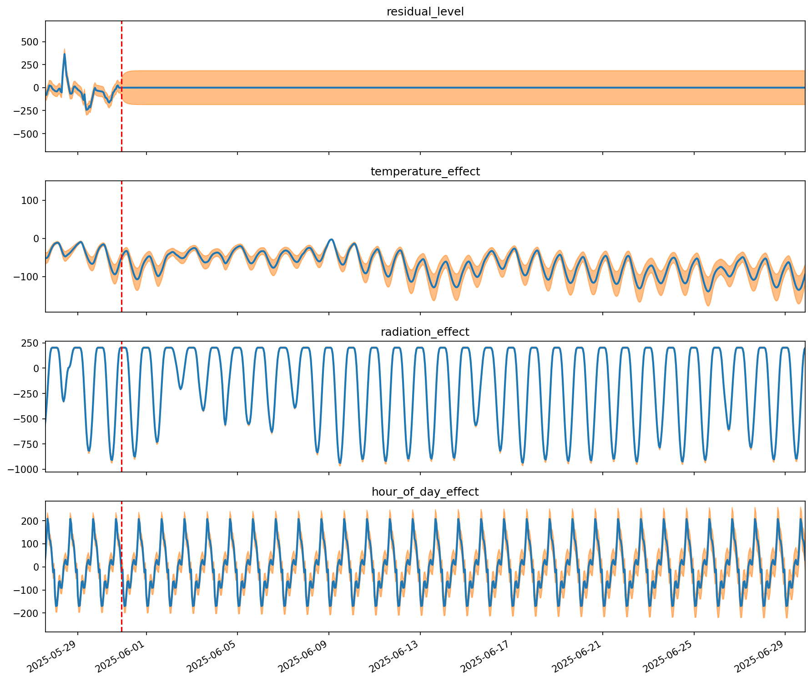
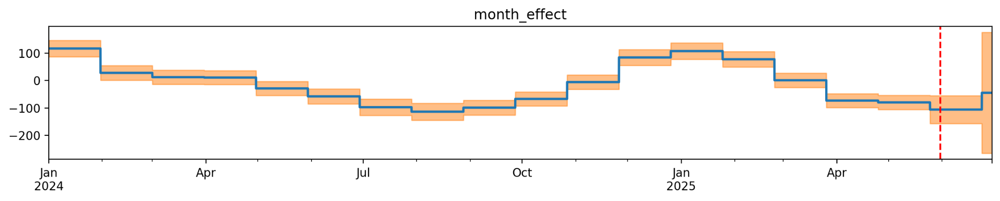

## Context and Introduction

As part of a job interview with a company specializing in **electrical load forecasting**, I was given — like so many times before — an assignment to complete and present.
This one was particularly enjoyable because it allowed me to leverage my expertise in **time series analysis** and **exogenous geospatial data**.

Additionally, as a long-time enthusiast of **Bayesian methods**, I decided to use this opportunity to experiment with them in the context of **multivariate time series forecasting**.
*Spoiler alert:* I received a job offer, which I probably should have accepted… but that’s another story.
My interviewers, naturally gave me the permission to add it to my project portfolio.

## Data

I was provided with an anonymized dataset spanning approximately **18 months**, consisting of load values recorded every **15 minutes**, likely from an industrial site.
The units were not specified, but it is reasonable to assume they were in **kW** or **kWh**.

In parallel, I chose to use **weather forecast data** (rather than actual measurements), specifically **solar radiation** and **temperature**.
The hypothesis was straightforward: increased sunshine should boost local electricity production and thus reduce load, while higher temperatures should decrease energy demand — whether for heating or thermally intensive processes.
- **Increased sunshine** → More local electricity production → **Reduced load**.
- **Higher temperatures** → Lower energy demand (heating, thermal processes).

---

## Methodology

### Why Bayesian Methods for Time Series?

First, Bayesian methods generate a *distribution of prediction* rather than a single point estimate, providing a **measure of uncertainty** through the variance of predictions.
After years of professional experience, I am convinced that any prediction without a confidence metric has only little real-world value.

Second, Bayesian methods yield relatively simple models with few parameters.
As is well known **in the fields of robustness and reliability, simplicity is a virtue**.

The key difference lies in how these parameters are calibrated: Bayesian methods generate a **probability distribution** for each parameter.
I won’t extand further into Bayesian methods, I would let interested readers explore the wide range of available courses and documentation.
However, building a simple model requires a **preliminary analysis of the time series**, as we will see below.

> *Any prediction without a confidence metric has only little real-world value.*

---

## Preliminary Analysis and Model Development

Here, we will construct a simple model based on the **sum of several structural components**, each resembling a sub-model with its own prior parameters.
The final model is thus similar to an **additive decomposition**, but with only the customs components needed to model the signal. This kind of model is called **Bayesian Structural Time Series** (BSTS).

### Trend Analysis

We begin by assessing the presence of a trend in the signal.
Unfortunately, with only 18 months of data, it is difficult to draw definitive conclusions.

Comparing monthly values for the overlapping period between **2024 and 2025 (January to June)** reveals a slight, almost systematic decrease in consumption — except in February.
However, we also observe a nearly systematic increase in solar radiation over the same period, except for February 2025, which was slightly lower than in 2024.

It is therefore impossible to distinguish a potential (very weak) trend from particularity of 2024, exibiting an unsual lower solar radiation level.
Additionally, the **Dickey-Fuller test** rejects the hypothesis of a temporal relationship. We will do the same and discard the hypothesis of a trend.

### Seasonality Analysis

Next, we analyze **seasonality** using autocorrelations of the signal, with hourly and daily resampling.
Unsurprisingly, the hourly resampling reveals a **daily seasonality** with pronounced hourly patterns: in general, consumption is highest after lunch.

  <figure style="margin:0; padding:0 4px; text-align:center; width:48%;">
    
    <figcaption style="font-size:0.9em; margin-top:0px;">(a) Autocorrelation on hourly signal</figcaption>
  </figure>
  <figure style="margin:0; padding:0 4px; text-align:center; width:48%;">
    
    <figcaption style="font-size:0.9em; margin-top:0px;">(b) Autocorrelation on daily signal</figcaption>
  </figure>

  <figure style="margin:0; padding:0 4px; text-align:center; width:48%;">
    
    <figcaption style="font-size:0.9em; margin-top:0px;">(c) Partial autocorrelation on hourly signal</figcaption>
  </figure>
  <figure style="margin:0; padding:0 4px; text-align:center; width:48%;">
    
    <figcaption style="font-size:0.9em; margin-top:0px;">(d) Partial autocorrelation on daily signal</figcaption>
  </figure>

However, we note **negative coefficients** in the partial autocorrelation at lag -24, which may indicate a **self-compensation phenomenon** between consecutive days.
The autocorrelation and partial autocorrelation of the daily signal are less clear, but both plots show slight **peaks at lags 7 and 14**, suggesting **weekly seasonality**. Yet, considering the very low amplitudes of these peaks we will decide to omit this seasonality in the model definition. 

### Correlation with Weather Variables

Finally, we validate the **correlation between weather variables and electricity consumption**.
Both correlations are **negative**, which is consistent with our initial hypothesis.

  
<em>Table 1. Correlation between features and electricity demand</em>

  <table style="margin: 0 auto;">
    <thead>
      <tr>
        <th></th>
        <th>Electricity demand</th>
      </tr>
    </thead>
    <tbody>
      <tr>
        <td>Temperature forecast</td>
        <td>-0.87</td>
      </tr>
      <tr>
        <td>Radiation forecast</td>
        <td>-0.82</td>
      </tr>
      <tr>
        <td>Temperature measured</td>
        <td>-0.93</td>
      </tr>
      <tr>
        <td>Radiation measured</td>
        <td>-0.88</td>
      </tr>
    </tbody>
  </table>

Naturally, consumption shows stronger absolute correlations with **actual weather measurements** than with **forecasts**, reflecting the inherent error in meteorological models.
This will likely impact our model’s performance.

However, in a **realistic production setting**, we limit ourselves to using **predicted values** — the only ones available a day in advance.

## Model

As a result, we establish the following model:

<!DOCTYPE html>
<html lang="fr">
<head>
  <meta charset="UTF-8">
  <title>Formules centrées</title>
  
  
  
</head>
<body>

  \[
  y_t =
  \underbrace{\gamma_{h(t)}}_{\text{Hourly effect (24h)}} +
  \underbrace{\mu_{m(t)}}_{\text{Monthly effect (12 month)}} +
  \underbrace{\beta_{\text{temp}} (x^{\text{temp}}_t - \bar{x}^{\text{temp}})}_{\text{Temperature effect}} +
  \underbrace{\beta_{\text{ray}} (x^{\text{ray}}_t - \bar{x}^{\text{ray}})}_{\text{Radiation effect}} +
  \underbrace{r_t}_{\text{AR(1)}}
  \]

  \[
  r_t = \phi r_{t-1} + \eta_t, \quad \eta_t \sim \mathcal{N}(0, \sigma_r^2)
  \]

</body>
</html>

Based on our analysis, the model does not include any trend term.
It does, however, contains **two distinct seasonal components**:

* One structured over **24 states** → captures **hourly variability**
* One structured over **12 states** → captures **monthly variability**

Two **regression terms** are also included to model the relationship with **weather covariates**.
These terms are **first-order**, meaning they only consider the prediction for the hour we want to estimate (`T_t` and `R_t`).

Given the higher variability in solar radiation, we could have experimented with multiple lagged values (`R_-1, … R_-n`), but we opted for the simplest solution.

Finally, we add an **autoregressive term** to model the **dynamics of the residuals**.
This term is essential: without it, residuals would be treated as independent, which is unrealistic in most practical applications.
It allows us to account for **unmodeled elements** and **propagate uncertainty** through predictions.
Without it, uncertainty could be underestimated.

---

## Optimization and Validation

TensorFlow Probability offers several sampling methods, including **Hamiltonian Monte Carlo (HMC)**, which is ideal for exploring **posterior distributions** of parameters.
Unfortunately, due to time constraints, we had to settle for **variational inference**.

This method does not truly sample the posterior distribution but provides a **parametric approximation**.
Without going into detail, HMC has the advantage of exploring the entire posterior distribution — even if some regions may be under-sampled — whereas variational inference may provide biased approximations of the posterior.

The illustration below shows a typical case of a **Gaussian prior parameter** that turns out to be **bimodal a posteriori**.
It demonstrates the bias of the variational inference estimator, which ignores one of the modes and assigns an inappropriate maximum probability.

### Validation

Given our dataset spans only 18 months, our choices were limited. We then reserved **the last month** as a **test period**, excluding it from all training and calibration processes to evaluate performance.

In a **real-world setting**, it would be necessary to repeat this test along the whole year, using only data prior to the test period for calibration and training.
This would allow us to assess the **stability of prediction errors** throughout the year.

Indeed, some phenomena may only appear in specific seasonal contexts.
If the model does not properly account for them, performance will vary over time.

---

## Results

The graphs below shows the **marginal posterior distributions** of the model components.
We observe that the **dynamic residual component** is centered on zero during the test period, with its variance stabilizing quickly.

  <figure style="margin:0; padding:0 4px; text-align:center; width:100%;">
    
    <figcaption style="font-size:0.9em; margin-top:0px;">(a) high-frequency components</figcaption>
  </figure>

  <figure style="margin:0; padding:0 0px; text-align:center; width:100%;">
    
    <figcaption style="font-size:0.9em; margin-top:0px;">(d) low-frequency component</figcaption>
  </figure>

If the residual had been modeled with an **autoregressive term of order greater than 1**, the variance would have taken longer to stabilize, further emphasizing the dynamic nature of the model.

The **covariate components** are interesting, but it would have been useful to **standardize** the weather variables in order to allow the estimation of the **marginal impact** of each on electricity consumption.

Finally, the **seasonal terms** show that the model effectively learns the different hourly and monthly levels.
Some slight confusion appear between **April and May**.
Nevertheless, the twelve seasonal components are well contered on the twelve months of the year — a pattern the model learns on its own, given that only the **fixed duration of 30 days per state** is predefined.
We could also have allowed the model to learn **distinct durations for each state**.

### Global Performance

We can compare the overall performance of our model during the test period.
Using a simple statistical decomposition (built with knowledge of the test period — i.e., a *“cheating”* model) as a benchmark, our solution improves the **explained variance** of the consumption signal by **27%**.

In comparison, the solution proposed by the company that issued the test improves it by **30%**.
We are thus only **3% behind**, which is more than respectable.

The table below summarizes the **R² (coefficient of determination)** and **MAE (mean absolute error)** scores for:

* Our solution (BSTS)
* The company’s solution
* The simple statistical decomposition

 | Model                     | R² (Explained Variance) | MAE (Mean Absolute Error) |
 |---------------------------|-------------------------|---------------------------|
 | **Our BSTS Model**    | 0.92                  | 18.42                 |
 | **Company’s Solution**    | 0.94          | 13.53                  |
 | **Simple Statistical Model** | 0.72              | 43.53                   |

